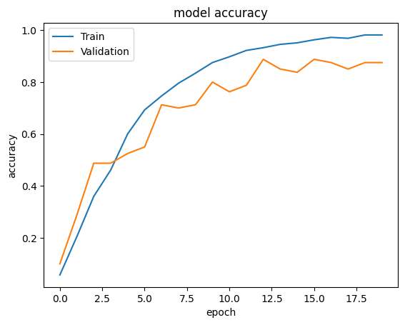
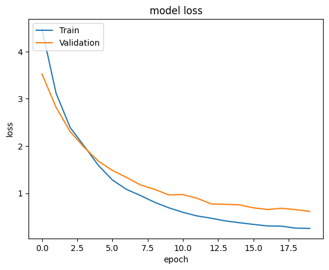

# ResNet50-Image-Classification
Image classification using ResNet50 on the UBIRIS V2 iris dataset. This project focuses on biometric recognition by training a deep learning model to classify iris images captured under visible light conditions.

# 🧠 ResNet50-Based Iris Image Classification Using UBIRIS V2

This repository presents a deep learning-based approach for iris image classification using the **UBIRIS V2** dataset. The project evaluates the performance of a **pre-trained ResNet50** architecture and a **custom-designed Convolutional Neural Network (CNN)** to classify iris images across **50 unique classes**.

## 🧪 Objective

The primary goal of this project is to assess the effectiveness of **transfer learning** in the domain of biometric image classification, specifically iris recognition, by comparing it with a CNN trained from scratch.

## 🚀 Quick Start

1. Clone the repository:  
   `git clone https://github.com/raianeyahiaoui/ResNet50-Image-Classification.git`

2. Install dependencies:  
   `pip install tensorflow matplotlib seaborn`

3. Run training script:  
   `python resnet50_train.py`
   
## ⚙️ Methodology

- **Dataset**: UBIRIS V2 (preprocessed into training and testing sets)
- **Image Size**: 224×224 RGB
- **Models Used**:
  - ResNet50 (transfer learning with fine-tuning)
  - Custom CNN (built and trained from scratch)
- **Frameworks**: TensorFlow & Keras

## 📈 Results

| Model         | Test Accuracy |
|---------------|----------------|
| ResNet50      | ≈ **96%**       |
| Custom CNN    | ≈ **82%**       |

The ResNet50 model significantly outperformed the custom CNN, highlighting the strength of transfer learning in limited-data biometric applications.

## 📂 Repository Structure

- `resnet50_train.py` – Training script for ResNet50
- `custom_cnn_train.py` – Training script for custom CNN
- `utils/` – Helper functions for preprocessing and evaluation
- `notebooks/` – Jupyter notebooks for experimentation (if applicable)

## 🧠 Conclusion

This project demonstrates that leveraging pre-trained models such as **ResNet50** can substantially improve classification accuracy in complex biometric datasets like **UBIRIS V2**. The findings support the integration of transfer learning in iris recognition systems and contribute to the advancement of deep learning in biometric authentication.

---

> Developed using Python, TensorFlow, and Keras  
> Dataset: UBIRIS V2 – https://iris.di.ubi.pt/ubiris2.html
## 📈 Result 
The following plots illustrate the training and validation accuracy and loss over the epochs:

- **Accuracy Plot
This plot shows the model's accuracy during training and validation. As seen, the training accuracy improves consistently, indicating effective learning, while the validation accuracy also shows good performance, reaching approximately 96% by the end of training.

- **Loss Plot
This plot depicts the training and validation loss over the epochs. The training loss decreases steadily, suggesting that the model is learning well, while the validation loss also decreases, reflecting good generalization to unseen data.

### Accuracy Plot

### Loss Plot

## 📚 References

- He, K., Zhang, X., Ren, S., & Sun, J. (2016). Deep Residual Learning for Image Recognition. *CVPR*.
- UBIRIS V2 dataset: https://iris.di.ubi.pt/ubiris2.html

## 📫 Contact

Raiane Yahiaoui  
Email: ikba.king2015@gmail.com 
LinkedIn: www.linkedin.com/in/yahiaoui-raiane-253911262

